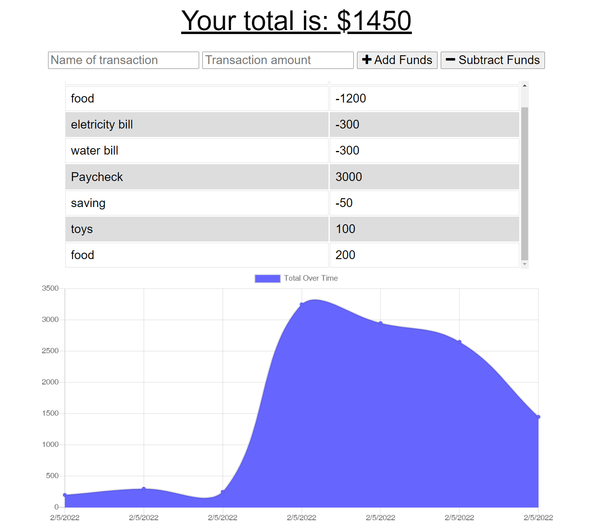

# savings-assistant

## This page is licensed under MIT: 

## Built With
* JavaScript
* Node.js
* Express.js
* NoSQL - MongoDB
* Heroku

## Table of Contents
* [Installation](#installation)
* [Links](#links)
* [Credits](#credits)
* [License](#license) 
* [Contributing](#contributing) 
* [Contact](#contact)

## Installation
MongoDB is required for this app.
`$npm i mongodb`  
`$npm start`  
`Open http://localhost:3001 on browser`

## Links
 
https://savings-assistant.herokuapp.com/

## Credits
Here are the list of collaborators:  
Kosal Cheykim

## License
Notice: This license is covered under (https://opensource.org/licenses/MIT)

## Contributing

## Contact
GitHub: http://github.com/ricky0320  
Email: ricxx0320@gmail.com